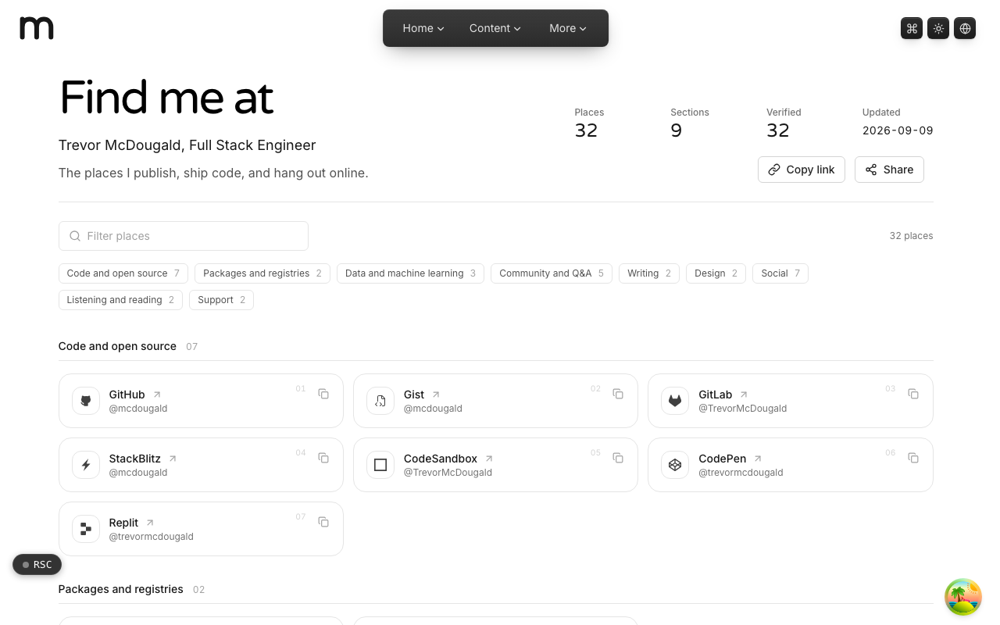

  <picture>
    <source media="(prefers-color-scheme: dark)" srcset=".github/assets/hero-dark.png">
    
  </picture>

# find.me.at

Every place to find Trevor McDougald online, in one link hub.

find.me.at is a self-hosted social directory: one card per place Trevor publishes, ships code, and hangs out online, from GitHub and GitLab to writing, design, and social profiles. It is a small static site that states its identity claims openly, so they can be verified from the other end.

## Features

- **One card per profile**: grouped into sections such as code and open source, packages and registries, writing, design, and social, each with its handle.
- **Filter and jump**: a filter box and section chips with live counts narrow the directory as you type.
- **Verifiable identity**: outbound profile links carry `rel="me"`, so a platform that links back can confirm both ends agree. The page reports how many links are verified, derived from the rendered markup rather than asserted.
- **Structured identity data**: an `h-card` microformat and `ProfilePage` JSON-LD whose `sameAs` list is built from the rendered cards.
- **Trusted destinations only**: every card link is checked against an allowlist of trusted hosts and profile-path rules.
- **Copy and share**: copy a single profile link from its card, or copy and share the whole hub. Nothing is stored.
- **Keyboard friendly**: arrow keys move through the card grid, and every card has an explicit accessible name.

## Built with

- Next.js 16 (App Router), React 19, TypeScript
- Tailwind CSS 4
- Microformats2 (`h-card`) and schema.org JSON-LD
- next-intl

## Part of the me.at family

find.me.at is one of the [`*.me.at`](https://me.at) apps by Trevor McDougald. They share one design system, account, and app shell. Development happens in a private monorepo; this repository is the project's public-facing home.

## License

See [LICENSE](LICENSE).
